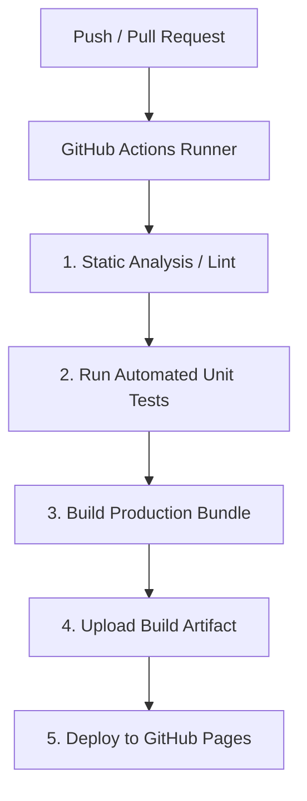

# 🚀 DesarrolloDevops — CI/CD Pipeline & DevOps Hub

[](https://github.com/Sebs0718/DesarrolloDevops/actions/workflows/ci.yml)
[](https://github.com/Sebs0718/DesarrolloDevops/actions/workflows/deploy-pages.yml)
[](tests/devopsUtils.test.js)
[](LICENSE)

Proyecto de desarrollo web moderno con **Integración y Despliegue Continuo (CI/CD)** completamente automatizado mediante **GitHub Actions**.

🌐 **Aplicación en Producción (GitHub Pages):**  
👉 [https://sebs0718.github.io/DesarrolloDevops/](https://sebs0718.github.io/DesarrolloDevops/)

---

## 📋 Tabla de Contenidos
- [Características Principales](#-características-principales)
- [Estructura del Proyecto](#-estructura-del-proyecto)
- [Flujo de CI/CD con GitHub Actions](#-flujo-de-cicd-con-github-actions)
- [Ejecución en Local](#-ejecución-en-local)
- [Cómo Configurar GitHub Pages en tu Repositorio](#-cómo-configurar-github-pages-en-tu-repositorio)
- [Comandos para Subir Cambios](#-comandos-para-subir-cambios)

---

## ✨ Características Principales

1. **Dashboard DevOps Interactivo**:
   - **Simulador de Pipelines en Tiempo Real**: Visualización paso a paso de etapas *Lint*, *Test*, *Build* y *Deploy* con consola de logs en vivo.
   - **Calculadora de Métricas DORA**: Evaluación interactiva de *Deployment Frequency (DF)*, *Mean Time to Recovery (MTTR)* y *Change Failure Rate (CFR)* para clasificar equipos de desarrollo (*Elite, High, Medium, Low*).
   - **Monitor de Salud de Infraestructura**: Simulación reactiva de carga de CPU, memoria y almacenamiento.
2. **Suite de Pruebas Unitarias Automatizadas**:
   - 17 pruebas unitarias sin dependencias externas usando el test runner nativo de Node.js (`node:test` y `node:assert`).
3. **Análisis Estático (Lint)**:
   - Verificación de integridad de código y sintaxis (`node --check`).
4. **Empaquetado y Artefactos**:
   - Generación de compilaciones optimizadas en `dist/` con manifiesto `build-info.json`.

---

## 📁 Estructura del Proyecto

```
DesarrolloDevops/
├── .github/
│   └── workflows/
│       ├── ci.yml                 # Pipeline CI (Lint, Pruebas y Empaquetado de Artefacto)
│       └── deploy-pages.yml       # Pipeline CD (Despliegue automático a GitHub Pages)
├── src/
│   ├── index.html                 # Página principal del Dashboard DevOps
│   ├── css/
│   │   └── styles.css             # Estilos Glassmorphism con tema Dark Mode
│   └── js/
│       ├── app.js                 # Lógica interactiva de la interfaz
│       └── devopsUtils.js         # Módulo de funciones matemáticas y métricas DORA
├── tests/
│   └── devopsUtils.test.js        # 17 pruebas unitarias automatizadas
├── scripts/
│   ├── lint.js                    # Script de análisis estático
│   ├── build.js                   # Script de compilación y metadata
│   └── server.js                  # Servidor local de desarrollo
├── package.json                   # Definición de scripts del proyecto
├── .gitignore                     # Archivos ignorados por Git
└── README.md                      # Documentación del proyecto
```

---

## 🔄 Flujo de CI/CD con GitHub Actions



### 1. `ci.yml` (Integración Continua)
- Se ejecuta en cada `push` o `pull_request` hacia las ramas `main` y `develop`.
- Descarga el código, configura Node.js 20, ejecuta `npm run lint`, corre las pruebas con `npm test`, genera el build con `npm run build` y sube el artefacto descargable `devops-dashboard-artifact`.

### 2. `deploy-pages.yml` (Despliegue Continuo)
- Se activa con cada `push` en `main` o `develop`.
- Despliega automáticamente la versión final de la aplicación en **GitHub Pages**.

---

## 💻 Ejecución en Local

### Prerrequisitos
- Node.js versión 18 o superior instalada.

### Pasos
1. Clonar el repositorio:
   ```bash
   git clone https://github.com/Sebs0718/DesarrolloDevops.git
   cd DesarrolloDevops
   ```

2. Ejecutar las pruebas unitarias:
   ```bash
   npm test
   ```

3. Ejecutar el análisis estático de código:
   ```bash
   npm run lint
   ```

4. Compilar la aplicación para producción:
   ```bash
   npm run build
   ```

5. Iniciar el servidor local:
   ```bash
   npm start
   ```
   Abre [http://localhost:3000](http://localhost:3000) en tu navegador.

---

## ⚙️ Cómo Configurar GitHub Pages en tu Repositorio

Para que GitHub Actions despliegue tu página automáticamente en la web:

1. Ve a tu repositorio en GitHub: `https://github.com/Sebs0718/DesarrolloDevops`
2. Haz clic en **Settings** (Configuración) ➔ pestaña lateral **Pages**.
3. En la sección **Build and deployment**:
   - En **Source**, selecciona **GitHub Actions** (en lugar de *"Deploy from a branch"*).
4. ¡Listo! En el próximo `push`, tu página estará disponible en:  
   `https://sebs0718.github.io/DesarrolloDevops/`

---

## 🚀 Comandos para Subir Cambios

Para subir el proyecto a GitHub y activar el pipeline:

```bash
# 1. Verificar estado de los archivos
git status

# 2. Agregar todos los archivos al commit
git add .

# 3. Crear el commit de desarrollo
git commit -m "feat: inicializar proyecto DevOps con CI/CD en GitHub Actions y Dashboard interactivo"

# 4. Subir a la rama develop (o main)
git push origin develop
```

Una vez ejecutado el push, entra en la pestaña **Actions** de tu repositorio en GitHub para ver la ejecución del pipeline en tiempo real. 🎯
